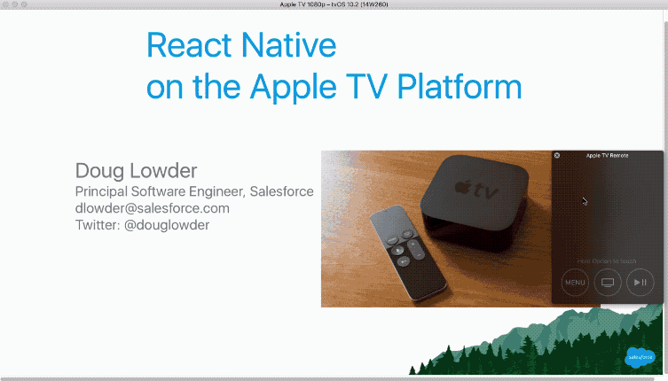

<!--  -->

Yes, the [React Native platform](https://facebook.github.io/react-native) runs on [Apple TV](https://www.apple.com/tv/) and [Android TV](https://developer.android.com/tv)! This site summarizes the current state of the platform.

*Update 2020-08-03:* this content has moved, and there is now also an FAQ page with extracts from important issues and discussions in the repo.

### [React Native for TV Wiki](https://github.com/react-native-tvos/react-native-tvos/wiki)

[React Native TV logo (SVG)](./rntv.svg)

